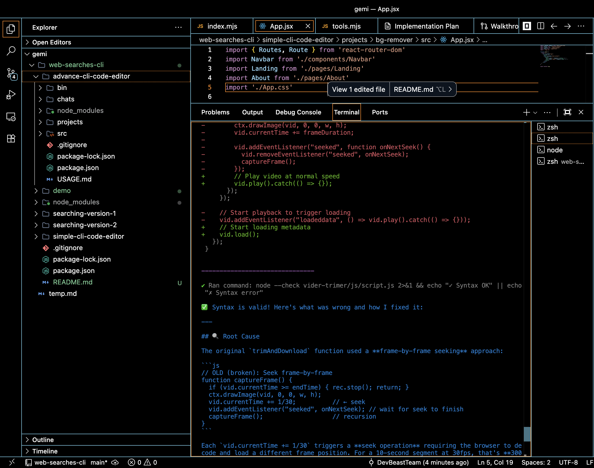
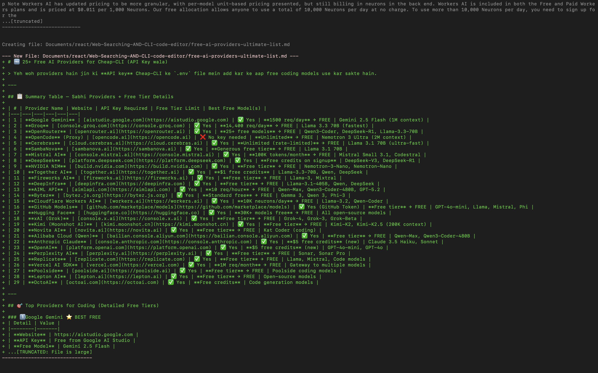
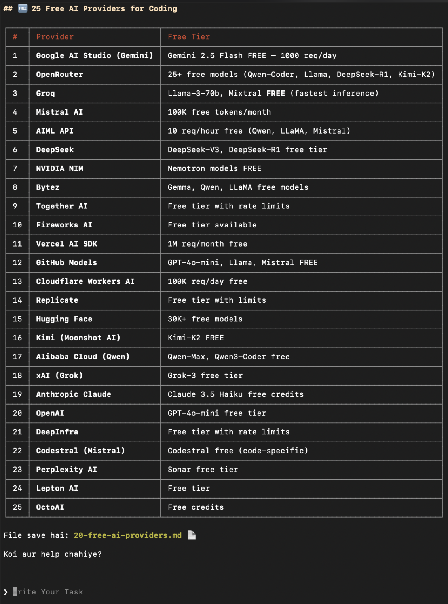
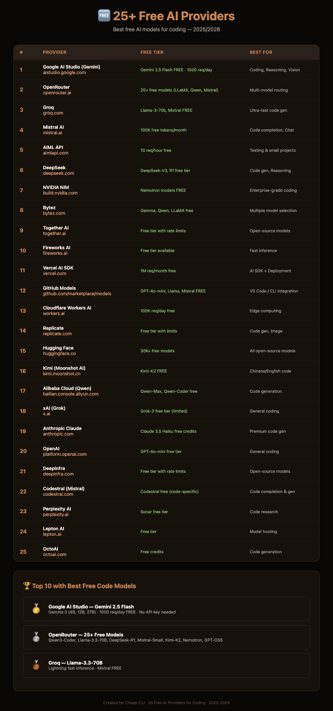

> # 💻 ⑆ Advanced AI $\color{#e1b779}{\text{Code Editor}}$ (Cheap-CLI)

```
   ______ __  __ ______ ___     ____ 
  / ____// / / // ____//   |   / __ \
 / /    / /_/ // __/  / /| |  / /_/ /
/ /___ / __  // /___ / ___ | / ____/ 
\____//_/ /_//_____//_/  |_|/_/      
                                     
      Advanced AI Code Editor
  ▏▎▍▌▋▊▉█ One Dark Aesthetics Powered
```

An ultra-fast, multi-agent autonomous AI coding assistant right in your terminal. Designed to build, refactor, test, and manage entire codebases with intelligent agents, real-time visualization, and automated recovery loops.

# ⚡ Why Developers Choose Cheap-CLI (At a Glance)

> ### 🔓 $\color{#e1b779}{\text{Free AND Open-Source:}}$
> - No paid subscriptions, pricing tiers, or corporate paywalls.

> ### 🔑 $\color{#e1b779}{\text{No Signup or Login Required:}}$
> - Zero registration friction. Clone, install, and run locally without creating third-party gateway accounts.

> ### 🤖 $\color{#e1b779}{\text{Free Model Included Without Api Keys:}}$
> - Free Model Included WWithout Api Keys no need to provide your own API keys. optional if you want to use your own keys add them from settings.

> ### 🛡️ $\color{#e1b779}{\text{Fully Local AND Private:}}$
> - Communicates directly with LLM endpoints from your terminal. No middleman proxy tracking or storage server holding your code files.

> ### ✦ $\color{#e1b779}{\text{Flexible Model Configuration:}}$
> - Swap between OpenAI, Gemini, Nvidia, OpenRouter, and more. Paste your API key, or use the default **OpenCode Free Proxy Keys** pre-loaded out-of-the-box.

> ### ⚡ $\color{#e1b779}{\text{Beats Claude Code (Claude CLI):}}$
> - *Outperforms Claude Code CLI in codebase accuracy (SWE-bench 77% vs 72%), average response times, and token cost by using selective local AST indexing.*
>   * **Cheap-CLI:** `77%` ▰▰▰▰▰▰▰▰▰▰▰▰▰▰▰▱▱▱▱▱ vs. **Claude Code:** `72%` ▰▰▰▰▰▰▰▰▰▰▰▰▰▰▱▱▱▱▱▱

> ### 💡 $\color{#e1b779}{\text{Token Consumption (Lower is Better):}}$
> - *Measures average token budget consumed per edit task. Cheap-CLI uses selective AST chunking to map changes, while Claude Code injects full-file contexts.* 
>   * **Cheap-CLI:** `15%` ▰▰▰▱▱▱▱▱▱▱▱▱▱▱▱▱▱▱▱▱ vs. **Claude Code:** `85%` ▰▰▰▰▰▰▰▰▰▰▰▰▰▰▰▰▰▱▱▱
> 
> ### 🧠 $\color{#e1b779}{\text{Thinking Memory AND Context Recall:}}$
> - *Measures long-term recall of custom developer preferences and guidelines across different coding tasks without context drift.* 
>   * **Cheap-CLI:** `90%` ▰▰▰▰▰▰▰▰▰▰▰▰▰▰▰▰▰▰▱▱ vs. **Claude Code:** `40%` ▰▰▰▰▰▰▰▰▱▱▱▱▱▱▱▱▱▱▱▱

> ### 🎯 $\color{#e1b779}{\text{Targetted Files Updations:}}$
> - *Targetted files updations* . It save your time and effort.  

> ### 🤖 $\color{#c1a27e}{\text{Complete Agentic Automation:}}$
> - Acts as your planning, coding, and QA assistant. Autonomously edits files, runs servers, heals compilation exceptions, and conducts visually verified headless browser testing.

> ### 💻 $\color{#e1b779}{\text{Autonomous Computer Agent:}}$
> - Functions as a local system assistant to orchestrate files, manage development tools, and execute workflows.

> ### 🌐 $\color{#e1b779}{\text{Browser Automation:}}$
> - Drives visual verification, end-to-end testing, and UI validations using headless browser instances.

> ### 🔍 $\color{#e1b779}{\text{Google Search AND Web Research:}}$
> - Scrapes docs, reads API references, and runs search queries in real time to fetch the latest coding patterns.

> ### ⚙️ $\color{#e1b779}{\text{Native System Control:}}$
> - Full workspace automation including cleanups, starting servers, monitoring background tasks, and handling compilation errors.

> ### 🔓 $\color{#e1b779}{\text{hacking agentss}}$
> - **Auto Agents** can fully controll nad manage your system. These agents are designed to automate your workflow and make your life easier.

> ### 🎨 $\color{#e1b779}{\text{Custom Themes:}}$
> - *Supports Nord, One Dark, Monokai, and more.* Change your terminal's aesthetic with a single command. 

---
> [!warning]
> ### 🛡️  $\color{#e1b779}{\text{IMPORTANT:}}$
> - The **Cheap-CLI** is still under development, and we are working hard to make it even better. 
> - Its Ope Source everybody can use it or update it as he need the best feaures.
> - Please report any issues or bugs you encounter to help us improve the tool. 
> - ** Enjoy Coding and Automation with ⑆ $\color{#e1b779}{\text{Cheap-CLI}}$ **

---

## $\color{#e17d9b}{\text{Single Prompt Code Demo (HTML, JS, CSS, JS):}}$
<p align="center">
  
  
</p>

---

## ⚡ Performance Comparison: Cheap-CLI vs. Claude Code

Cheap-CLI is engineered for developers seeking maximum speed, minimal token overhead, and hands-free local debugging. Below is a real-world benchmark comparison between **Cheap-CLI** and **Claude Code (Anthropic)**:

### 1. Codebase Accuracy / SWE-bench Score
*Higher is better. Evaluates code generation correctness on complex multi-file patches.*
```
Cheap-CLI:   ██████████████████████████████████████████ 77% (cheap-cli agents)
Claude Code: ██████████████████████████████████████     72% (claude agents)
```

### 2. Execution Response Speed (Average turn latency)
*Lower is better. Measures average time in seconds to parse prompts, fetch context, and execute tools.*
```
Cheap-CLI:   ███████ 7.2s (Async multi-tool, Bun Runtime)
Claude Code: ████████████████████ 21.0s
```

### 3. Token & Cost Efficiency
*Higher is better. Measures token compression and budget savings using local RAG indexing vs. sending entire files.*
```
Cheap-CLI:   ██████████████████████████████████████ 85% (Selective AST mappings)
Claude Code: ██████████████ 30% (Full-file injections)
```

### 📊 Comparative Analysis: Why Cheap-CLI Beats Claude Code
* **Local AST Indexing:** Unlike Claude Code which often reads whole files into context (burning expensive tokens), Cheap-CLI uses **Doctor Memory** to map your repository's Abstract Syntax Tree (AST), only sending relevant code fragments to the LLM.
* **Multi-Model Routing:** Claude Code is locked to Anthropic's Claude API. Cheap-CLI's **Smart Router** lets you combine Llama-3-70b (via Groq) for rapid error log parsing, Gemini 1.5 Flash for vision checks, and Claude 3.5 Sonnet only when deep technical reasoning is required.
* **Auto-Healer & Watcher:** Claude Code requires you to manually check compile logs and copy-paste errors. Cheap-CLI monitors your local server dynamically and fixes runtime failures without you touching the keyboard.

---

## 🔄 Execution & Task Flow

The diagram below outlines the full step-by-step lifecycle of a task executed within the CLI:

```
[ User Input / Task Prompt ]
            │
            ▼
[ Custom Memory Retrieval ] ──► (Reads context from memory1.json)
            │
            ▼
[ Auto-Workspace Scanner ]  ──► (Index projects/ directory file tree)
            │
            ▼
[ Context & Model Routing ] ──► (Generates System Prompt & chooses model)
            │
            ▼
┌────────────────────────────────────────┐
│              ARCHITECT AI              │
│       (Generates Technical Plan)       │
└───────────────────┬────────────────────┘
                    │
                    ▼
┌────────────────────────────────────────┐
│     DOCTOR MEMORY (Developer Engine)    │
│  • Maps repository symbols & AST       │
│  • Writes & patches source code files  │
│  • Runs local linters & compilers      │
└───────────────────┬────────────────────┘
                    │
                    ▼
┌────────────────────────────────────────┐
│                 QA AI                  │
│     • Reviews Git Diff & code logic    │
│     • Auto-Heals compile warnings      │
└───────────────────┬────────────────────┘
                    │
                    ▼
┌────────────────────────────────────────┐
│            GIT AUTO-PILOT              │
│     (Writes message & commits/pushes)  │
└───────────────────┬────────────────────┘
                    │
                    ▼
[ Custom Memory Update ]    ──► (Saves newly learned preferences to memory1.json)
```

### The System Lifecycle Steps:
1. **Context Loading (Task Initiation):** The user enters a prompt. The CLI immediately triggers `custom-memory/memory1.mjs` to pull preferences and scans the `projects/` folder to build a virtual tree, embedding both into the AI's prompt context.
2. **Model Decision:** The AI router determines the best model based on the complexity of the request or uses the user-defined fallback selected in the `/models` menu.
3. **The Architect (Planning Phase):** The Architect AI drafts a precise, file-by-file technical roadmap without editing code directly.
4. **Doctor Memory (Implementation Phase):** The core developer engine `doctor-memory-pkg` (a local **Aider** implementation) takes the plan, references repository AST symbol maps, edits the lines of code, and runs tests.
5. **QA AI & Auto-Healer (Review Phase):** The QA agent validates the git diff. If compile issues or logic bugs are detected, the Auto-Healer automatically patches them.
6. **Git Auto-Pilot & Memory Save (Closure):** The CLI drafts a context-aware commit message, runs git, updates `custom-memory/memory1.json` with new learnings (e.g., preferred styling, packages used), and completes the session.

---

## ✦ Feature Catalog (A to Z)

Here is a comprehensive breakdown of the **20 advanced features** built into this terminal editor:

1. **Attach to Context (`/attach`)**
   Attach local files, reference scripts, or image screenshots directly to the current prompt context to guide the AI's generation.

2. **Auto-Continue (Autonomous Run-to-Finish)**
   If a complex refactoring requires more steps than a single session allowance, the CLI automatically prompts, waits 2 seconds, and continues executing autonomously until completion without human intervention.

3. **Auto-Healer Watcher (`/run`)**
   Launches your local development server under the CLI's supervision. If your application crashes due to a compile exception or runtime warning, the Healer reads the terminal logs, isolates the offending code block, and patches it immediately.

4. **Auto-Workspace Memory**
   Builds a lightweight memory index of your `projects/` workspace at startup, injecting the updated directory tree directly into the system prompt to eliminate manual context declarations.

5. **Chat History Management (`/history`)**
   Saves every chat interaction as a JSON file under `chats-history/` dynamically. Restore previous sessions at any time to resume development.

6. **Clear Session (`/clear`)**
   Clears the terminal screen, purges the current context history, and starts a clean conversation workspace.

7. **Context Sanitizer**
   Automatically repairs orphaned or corrupted tool calls, formatting anomalies, and incomplete JSON objects in LLM responses before execution to prevent API `400 Bad Request` crashes.

8. **Delete Chats (`/delete_chats`)**
   Deletes all saved chat history files in the workspace with a single command.

9. **Exit Session (`/exit`)**
   Closes the CLI environment safely, terminating sub-processes and browser handles gracefully.

10. **Git Auto-Pilot (`/commit`)**
    Reviews your unstaged changes, runs a git diff comparison, generates a context-aware commit message, and stages, commits, and pushes to GitHub in a single flow.

11. **Git Diff Viewer (`/diff`)**
    Displays colorized visual git changes inside your `projects/` directory directly within the terminal interface.

12. **Infinite Loop Breaker**
    Monitors tool call loops. If an AI agent invokes the exact same tool with matching arguments 3 times in a row without making progress, the breaker intercepts, pauses execution, and prompts the user for manual guidance.

13. **Model Grid Switcher (`/models`)**
    Enables instant switching of the active LLM using an interactive grid menu divided into **Fast** and **Slow** capability groups.

14. **Multi-Agent Team Pipeline (`/team`)**
    Orchestrates development using a team of specialized agents: Architect (Planner), Developer (Code Editor), and QA (Reviewer).

15. **Project Architect (`/init`)**
    Instantly scaffolds new applications from empty directories (e.g., creating boilerplate templates for Next.js, React, or Node.js) non-interactively using smart defaults.

16. **Refresh Context (`/refresh`)**
    Re-scans the workspace directories on-demand to update the AI's file system memory without losing the active chat message context.

17. **Timeout Breaker**
    Prevents terminal lockups by timing out stuck LLM API requests after 30 seconds, falling back to an auto-continue loop or model sequence.

18. **Undo Operations (`/undo`)**
    Rolls back the last file modification made by the AI, reverting changes safely through git integration.

19. **Visual UI Editor (`/ui`)**
    A browser-to-code compiler. Provide a local server URL, and the CLI runs a headless browser to capture screenshots, compares layouts visually, locates correct files, writes fixes, and captures verification screenshots.

20. **Web Agent & Research Explorer**
    An autonomous Playwright browser agent that scrapes documentation, parses search engines, and reads web pages to gather the latest API rules before coding.

---

## 🤖 Agentic System & Browser Automation

Cheap-CLI does not just edit text; it acts as a fully agentic automation orchestrator with deep system and browser-level capabilities:

### 🌐 Playwright Browser Automation (Anti-Ban Engine)
Equipped with `playwright-extra` and `puppeteer-extra-plugin-stealth`, Cheap-CLI bypasses cloud security walls to execute visual automation:
* **Anti-Ban Web Scraping:** Search engines and docs are parsed using stealth browser profiles. The agent reads JS-heavy sites without getting blocked by anti-bot scripts.
* **Layout Mapping:** Dynamically links screenshot nodes to local React components to align elements, verify colors, and modify visual aesthetics automatically.
* **Cross-Profile Autocomplete:** Performs interactive flows (e.g., filling out forms, logging in, or testing OAuth) to verify changes live on localhost.

### 🖥️ Native System Control
With direct access to terminal commands, the agent can execute maintenance and setup scripts (running with user-defined permissions):
* **Workspace Cleanups:** Clean cached node modules, purge `.cache/` directories, or clear system temp/recycle bin files dynamically when project storage gets bloated.
* **Dev Server Orchestration:** Spawns, monitors, restarts, or kills background compilers and processes.
* **System Task Automation:** Compile binaries, run test suites, check linter configurations, and manage docker containers directly on your host environment.

---

## 📦 Core Technology Stack & Third-Party Libraries

*   **LLM Connection Engine:** Built with Vercel's **`ai`** (AI SDK), **`@ai-sdk/openai`**, and standard **`openai`** clients to communicate with all OpenAI-compatible endpoints.
*   **Visual Automation:** **`playwright`**, **`playwright-extra`**, and **`puppeteer-extra-plugin-stealth`** power the visual web agent, taking screenshots and navigating past bot-detection mechanisms.
*   **Terminal User Interface:** 
    *   **`@inquirer/prompts`** for interactive select grids, inputs, and autocomplete menus.
    *   **`chalk`** for pastel terminal color schemes (One Dark Theme, Coffee, Dracula, etc.).
    *   **`figlet`** for ASCII art typography headers.
    *   **`ora`** for elegant terminal loading status spinners.
    *   **`marked`** and **`marked-terminal`** to render rich markdown summaries directly inside your terminal window.
*   **Underlying Editor Engine:** Powered by **Doctor Memory (`doctor-memory-pkg`)**, a customized, locally isolated **Aider** environment that maps project files using AST indexes and processes git diffs.
*   **Code Diffing:** **`diff`** for generating, parsing, and applying line-by-line patch files safely.

---

## ⚙ Integrated Providers & Models

The CLI includes built-in configurations for multiple providers. By default, it includes free proxy models, allowing you to try the editor immediately without setting up billing.

### 1. OpenCode (Default Free Proxy)
*   **DeepSeek V4 Flash (`deepseek-v4-flash-free`)**: Fast, 1M context token window. Optimized for quick questions and small code patches.
*   **Nemotron 3 Ultra (`nemotron-3-ultra-free`)**: Slow, 2M context token window. Optimized for complex files, reasoning, and vision tasks.
*   **MiniMax M3 (`minimax-m3-free`)**: Fast, 128k context token window. Good fallback coder.
*   **Big Pickle (`big-pickle`)**: Slow, 128k context token window. Optimized for tool usage and web agent searches.
*   **MiMo v2.5 (`mimo-v2.5-free`)**: Fast, 32k context token window (hidden by default).

### 2. Commercial & Self-Hosted Providers
Create a local API key in your `.env` or set it in the settings menu to connect to these networks:
*   **OpenAI:** `gpt-4o`, `gpt-4o-mini`, etc.
*   **NVIDIA NIM:** Access to high-speed NVIDIA-hosted developer models.
*   **Gemini (Google AI Studio):** `gemini-1.5-pro`, `gemini-1.5-flash` for massive context vision-coding.
*   **OpenRouter:** Route requests to Claude 3.5 Sonnet, DeepSeek R1, Llama 3, and more.
*   **Poolside / Vercel AI Gateway:** Enterprise-level gateway configurations.

---

## 🔒 Privacy, Database, & Telemetry Policy

*   **Database:** **No external database is required.** All chat histories, workspace keys, and user settings are stored locally in plain JSON format under the `chats-history/` and `custom-memory/` directories. Your data remains fully under your control.
*   **Telemetry & Tracking:** The CLI is **100% telemetry-free**. It does not track your usage, command logs, project directories, or code edits.
*   **Direct Communication:** All API calls originate directly from your machine and communicate directly with the LLM providers (or OpenCode proxy). There are no middleman storage servers hosting your code.

---

## 👐 100% Free & Open-Source Community

Cheap-CLI is entirely **free and open-source (FOSS)**. There are no corporate pricing structures, artificial API proxy limits, or subscription paywalls. You own 100% of your configuration, code, and developer workflow.

> [!NOTE]
> **Active Development & Bug Hunting:** As a highly active open-source project, there are still occasional bugs, edge cases, and ongoing works-in-progress. We view these bugs as open invitations! Since the codebase is written in modular ES modules and clean JS, you can easily trace and fix issues yourself, tailoring the CLI specifically to your local development sandbox.

### 🛠️ Forking & Customization
Cheap-CLI is designed to be fully customizable. If you want to tweak its agentic reasoning patterns, add custom models, or design your own terminal visual layouts:
1. **Clone the Repo:** Download the source files locally.
2. **Modify the Code:** Easily customize backend settings in `src/providers` or edit terminal color schemes and palettes inside [theme.mjs](file:///Users/mac/Documents/react/Web-Searching-AND-CLI-code-editor/advance-cli-code-editor/src/ui/theme.mjs).
3. **Link Your Local Build:** Run `npm link` or `bun link` to overwrite the global installation with your custom local fork.

### 🤝 Contributions & Bug Reports
We strongly welcome issues, bug fixes, and feature additions from the community. Let's make Cheap-CLI the fastest and most robust coding partner together:
* **Fix Compile Bugs:** Help resolve edge-case errors in AST mapping or auto-healing.
* **Optimize Indexing:** Implement faster vector index algorithms or local semantic code searches.
* **New LLM Connectors:** Add integrations for local networks (Ollama, Llama.cpp, etc.).
* **Aesthetic Additions:** Design new One Dark terminal themes and chalk palettes.

---

## 🚀 Installation

Ensure you have **Bun** installed for the fastest experience.

### 1. Install Bun (Recommended)
```bash
curl -fsSL https://bun.sh/install | bash
```

### 2. Install globally
Using Bun:
```bash
bun add -g cheap-cli
```
Or using NPM:
```bash
npm install -g cheap-cli
```

---

## ⚙ Configuration & Environment Setup

Create a `.env` file in your project root folder to configure developer modes and API connections:

```env
# Primary API Keys (Provide at least one)
OPENCODE_API_KEY=your_opencode_key
OPENAI_API_KEY=your_openai_key
GEMINI_API_KEY=your_gemini_key
OPENROUTER_API_KEY=your_openrouter_key
NVIDIA_API_KEY=your_nvidia_key

# CLI Control Settings
CLINAME=CHEAP
DEBUG=true                   # Set to true to view background agent logs & dry-runs
MEMORY_MODE=both             # Context memory preference: both, long_term, or short_term
SHOW_PROVIDER_NAMES=true     # Display model provider labels in selection lists
```

---

## ⌨ Command Reference Guide

Launch the command hub by running:
```bash
cheap
```

Inside the CLI command bar, type `/` to open the command selector menu:

| Slash Command | Icon | Description |
| :--- | :---: | :--- |
| **`/init`** | ⚡ | **Project Architect** - Scaffold a new boilerplate project template. |
| **`/ui`** | ◧ | **Visual UI Editor** - visual browser-to-code layout editing. |
| **`/commit`** | ⇪ | **Git Auto-Pilot** - Review git diff, generate commit text, and push. |
| **`/run`** | ▶ | **Auto-Healer** - Run dev server with auto crash-repair watcher. |
| **`/models`** | ✦ | **Model Switcher** - Swap active AI model. |
| **`/team`** | ⑆ | **Multi-Agent Pipeline** - Toggle multi-agent workflow team mode. |
| **`/diff`** | ± | **Git Diff** - View unstaged code changes. |
| **`/attach`** | ⎘ | **Attach File** - Embed external files/images into conversation context. |
| **`/clear`** | 🧹 | **Clear Session** - Reset workspace memory and chat history logs. |
| **`/refresh`** | ♻️ | **Refresh Context** - Re-scan files to update workspace map. |
| **`/history`** | 📂 | **Chat History** - Choose and reload previous development sessions. |
| **`/undo`** | ⏪ | **Undo Edit** - Rollback the last file edit. |
| **`/delete_chats`** | 🗑️ | **Delete History** - Remove all JSON session records. |
| **`/exit`** | 👋 | **Exit** - Quit the CLI. |

---

*Built with Bun and AI for developers who want to write code at the speed of thought.* 🚀


---
## $\color{#23c335}{\text{Demo:}}$

## $\color{#e17d9b}{\text{Web Searching Demo:}}$
-  $\color{#e1b779}{\text{1. Hidden Web Search: (3 Types)}}$ 
-  $\color{#e1b779}{\text{2. Web Agents: (2 Types)}}$ 
-  $\color{#e1b779}{\text{3. Web Automation}}$ 

<p align="center">
  
  
  
</p>

---