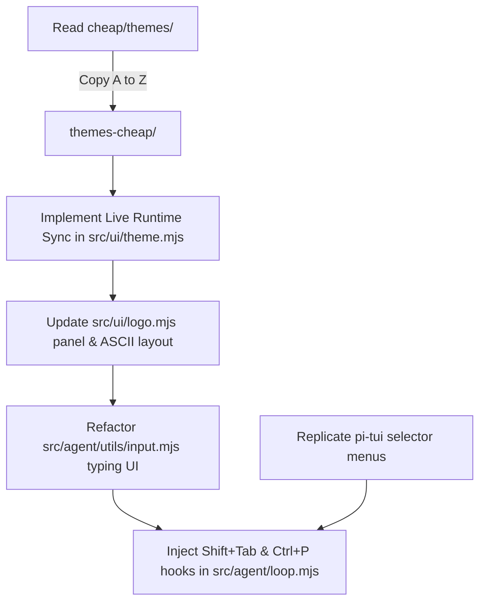

# Cheap-CLI Terminal Design Migration Prompt & Plan

This document serves as a complete prompt and strict execution plan to migrate the visual styling, theme engine, interactive layout, and UI mechanics of the `cheap` CLI into the `old-cli-code-editor` (Old CLI) codebase.

**CRITICAL DIRECTIVE**: The visual design, layout, and theme switching flow must be 100% "ditto" identical to the `cheap` CLI. Nothing should be left out. The theme flow, light/dark modes, and palettes must be replicated A to Z.

---

## Part 1: Source Material Analysis & UI Elements to Migrate

The new `cheap` CLI architecture utilizes an upstream agent framework (`@earendil-works/pi-coding-agent`) combined with a terminal TUI library (`@earendil-works/pi-tui`) and a custom harness. The migration must extract design tokens, layouts, and mechanics from the following areas:

### A. Theme Engine & Runtime Syncing (A to Z Replication)
1. **JSON Theme Files (Light & Dark Modes):**
   * The `cheap/themes/` folder contains exactly 32 `.json` files (e.g., `black-tea.json`, `cheap-light.json`, `dark.json`, `dracula.json`, `light.json`, `neon.json`, etc.).
   * These files contain dynamic palettes defining variables (`vars`) and color roles (`colors`).
   * **Action required:** Every single JSON theme file must be copied exactly as it is into `old-cli-code-editor/themes-cheap/`.
2. **Live Runtime Syncing (The `pi-coding-agent` Flow):**
   * Upstream in `pi-coding-agent` (via patches like `previewTheme`), navigating through the theme menu using arrow keys instantly changes the CLI colors *before* pressing enter.
   * **Action required:** The old CLI's theme prompt (`src/ui/theme.mjs`) must implement **Runtime Syncing**. When the user scrolls through the theme list (e.g., from a light mode theme to a dark mode theme), the terminal colors must update instantly in real-time.
3. **Palette Mapping:**
   * Colors must map to: `success`, `error`, `warning`, `info`, `system`, `dim`, `highlight`, `user`, `accent`, `border`, `borderAccent`, `toolTitle`, `mdHeading`, `mdCode`, `mdLink`, `bashMode`, and `customMessageBg`.

### B. Core Styling & Border Stroke Accent (`@earendil-works/pi-tui` and Patches)
1. **Left-Border Stroke Indicator (`▍ ` or `▌ `):**
   * Instead of drawing solid background color blocks around markdown, logs, or text cards, `cheap` uses a left-edge stroke accent (`▍ ` or `▌ `) in the theme's accent color (with a cell width of 2).
   * Migrated code should replace block highlights with this sleek left-border stroke.
2. **Text Area and Prompts Background:**
   * Text areas and inputs use a faint background tint (modeled by `customMessageBg` mapped to a hex code like `#18110c` or `#1e1e1e`), creating visual contrast for inputs.

### C. Logo and Header Layout (`cheap/src/components/logo.ts`)
1. **The ASCII Art & Outer Box:**
   * The header consists of a custom ASCII dollar sign logo.
   * An outer thin box (`┌──────┐`, `│      │`, `└──────┘`) wraps the header.
2. **Panel Structure:**
   * **Left Panel:** Holds the logo art and version details + active workspace path + git branch link (`dim` style).
   * **Right Panel:** Prominently lists `"Cheap's special:"` tips, dynamically wrapped to fit the terminal width (`rightColWidth`), separated by a thin accent line (`───`).
   * Below the box, a dim subtitle `"cheap AI terminal"` is displayed.

### D. Input Field and Keyboard Mechanics (`cheap/src/components/editor.ts`)
1. **Interactive Layout:**
   * Double-line layout box prefix (`▌ ` or `▍ `) in the theme accent color.
   * Background color set to `customMessageBg` hex.
   * Auto-expanding input area that grows cleanly when typing multi-line tasks.
   * **Placeholder styling:** Thick bright gray and bold placeholder text (`ask anything or type / for commands`, styled with `\x1b[90m\x1b[1m`).
2. **Keyboard Events:**
   * `Shift+Tab` cycles the permissions mode (e.g., sensitive, automatic, etc.).
   * `Ctrl+P` hotkey cycles active models.
   * Slash command list overlays: interactive popup overlay menus with clean borders and active selection highlighting in the accent color.

### E. Tips Visuals (`cheap/src/extensions/tips/`)
1. **Format:** Show keyboard commands highlighted inside backticks (e.g., `Press shift+tab...`) in a dim box styled as:
   ```text
   ⎡ ⓘ Tip: Press shift+tab to change permissions mode.
   ⎜
   ```
2. Tip commands should be colored in the theme's brand accent color, while instruction text remains dim.

---

## Part 2: Step-by-Step Migration Plan for Old CLI

You must perform the following modifications in the target codebase `old-cli-code-editor/`:



### Step 1: Align Theme Engine & Implement Runtime Sync (`src/ui/theme.mjs`)
1. **Copy all 32 files:** Ensure all JSON themes from `cheap/themes/` are copied to `old-cli-code-editor/themes-cheap/`.
2. **Live Preview Logic:** Modify the theme selection menu (using `@inquirer/prompts` or a custom selector) so that changing the highlighted item triggers an immediate callback that updates the active terminal theme. This completely matches the `pi-coding-agent` flow where arrow keys sync the theme on the fly.
3. Ensure variable resolution (`resolveColor`) matches the cheap CLI system perfectly.
4. Make sure active color codes dynamically color code spans (`mdCode`), links (`mdLink`), headers (`mdHeading`), and borders (`borderAccent`).

### Step 2: Implement Left-Border Stroke Renderer
1. Create a helper function in `src/ui/theme.mjs` or `src/agent/utils/console.mjs` representing the left-edge stroke rendering logic.
2. In elements that display markdown responses, logs, or tool executions, prepend the left-edge indicator `▍ ` colored with `theme.accent` to lines instead of using solid backgrounds.

### Step 3: Upgrade Header and Logo (`src/ui/logo.mjs`)
1. Align the outer box dimension rendering to match cheap's `LogoHeader`.
2. Correctly compute `rightColWidth` dynamically on terminal window resizing.
3. Keep the right-panel tip wrap-around format visually identical, utilizing the custom border accent functions.

### Step 4: Redesign Prompt Input Box (`src/agent/utils/input.mjs`)
1. Change the visual rendering of the input loop to display the prefix `▌ ` or `▍ ` and apply background coloring `customMessageBg` to fill the entire width.
2. Replicate the placeholder styling to use a thick bright gray color (`\x1b[90m\x1b[1m`).
3. Ensure input buffer edits trigger instant redraws of the box height and caret position without flickering.

### Step 5: Hook Keybindings and Menus (`src/agent/loop.mjs`)
1. Add stdin listeners in `src/agent/loop.mjs` for:
   * **`Shift+Tab`:** Toggles the permission configuration loop.
   * **`Ctrl+P`:** Iterates to the next model in the model registry.
2. Ensure slash menus and model select menus are styled with the theme's brand accent colors, matching the selection indicators of the cheap CLI.

---

## Part 3: Strict Migration Verification Guide

After carrying out the changes:
1. Launch the old CLI using `./bin/cheap.mjs`.
2. **Theme Sync Test:** Trigger the `/theme` command. Verify that as you press the Up/Down arrow keys through the 32 themes (Light, Dark, Chocolate, etc.), the terminal's colors, background, and borders update *instantly* in real time before pressing Enter.
3. **Palette Test:** Verify that markdown headers, bash mode texts, links, and success checkmarks dynamically follow the loaded JSON palette.
4. Verify the exact input box styling (`▌ ` border + `customMessageBg` tint) matches `cheap` 1:1.
